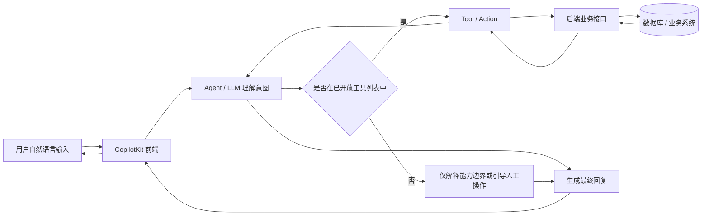

# CopilotKit 接入后可提供的功能

接完 CopilotKit 之后，能提供的功能取决于你给 agent 开放哪些业务能力。按当前“皇冠赛”项目，比较自然的是以下几类。

## 结构图

下面这张图描述的是“自然语言调用接口”的基本链路：



你可以把它理解成四层：

- **用户层**：用户直接说需求
- **理解层**：LLM 只负责判断意图，不直接改数据
- **执行层**：只有你显式开放的 tool 才能被调用
- **业务层**：tool 再去调用你的后端接口，完成查询、提交、审核、计算等动作

关键点是：

- 不是所有接口都天然可被调用
- 只有你在 agent 里注册过的能力，模型才可以选
- 复杂任务可以拆成多个 tool 串联
- 写操作最好保留二次确认

## 1. 页面助手

用户在任何页面都能问：

- 这个页面在做什么
- 这个分数怎么算
- 我下一步该点哪里
- 当前页面有哪些注意事项

## 2. 业务问答

助手可以解释项目里的业务规则，例如：

- 赛季规则
- 评分维度
- 岗位指标
- 组织分
- 举证状态
- 飞书同步结果

## 3. 数据查询

用户可以用自然语言查询自己的数据，例如：

- 我的当前成绩
- 我的排名
- 我的分数拆解
- 我的举证记录

管理员可以查询更多管理数据，例如：

- 赛季成员
- 待审核举证
- 某个成员的评分明细
- 飞书同步状态

## 4. 操作引导

助手可以根据用户意图引导到对应功能，例如：

- 帮我提交一条举证
- 怎么给某个成员录入组织分
- 飞书同步失败要看哪里
- 如何触发赛季评分计算

第一阶段可以先做“引导用户去操作”，后续再让助手自动填表或执行动作。

## 5. 自动化操作

如果后端 agent 接入写接口，可以让助手代用户执行动作，例如：

- 创建赛季
- 触发评分计算
- 审核举证
- 同步飞书数据
- 录入或更新分数

这类功能需要严格做权限校验和二次确认，尤其是管理员操作和会修改数据的操作。

## 6. 上下文感知

助手可以知道当前登录用户、用户角色和所在页面，因此可以提供更贴近场景的回答。

例如：

- 普通成员只看到和自己相关的成绩、举证、排名说明
- 管理员可以看到管理后台、审核、同步、评分计算相关说明
- 在不同页面，助手可以根据当前路由解释页面功能

## 当前已完成的部分

当前已经接入的是前端基础能力：

- 浮动聊天入口
- CopilotKit provider
- 当前用户上下文
- 当前页面路由上下文
- 系统核心能力上下文
- 后端 CopilotKit runtime + `match_scoring_points` tool

## 已注册的 CopilotKit Actions（前端 useCopilotAction）

### 用户侧

| 页面 | Action | 触发示例 | 聊天内渲染 |
|------|--------|----------|-----------|
| Dashboard (`/`) | `query_my_scores` | "我的成绩"、"各维度得分" | 总分+排名+271标签+各维度进度条 |
| Rankings (`/rankings/:seasonId`) | `query_rankings` | "当前排名"、"产品岗排名" | 排名表格，高亮当前用户 |
| EvidenceList (`/evidence/mine`) | `query_my_evidence` | "我的举证状态"、"有多少通过了" | 状态汇总标签+举证列表 |

### 管理员侧

| 页面 | Action | 触发示例 | 聊天内渲染 |
|------|--------|----------|-----------|
| EvidenceReview (`/admin/evidence`) | `query_pending_evidence` | "待审核举证"、"有多少条待审核" | 待审核数量+提交人/标题/赛季列表 |

### 实现要点

- 所有 action 通过 `copilotConfig.enabled` 条件注册，未启用时不会调用 hook
- handler 直接调用 `client/src/api/` 下已有函数，无后端改动
- render 函数使用 Ant Design 组件（Card、Tag、Progress、Descriptions），保持风格一致
- action 挂载在对应页面组件内，用户离开页面时自动卸载

### 待扩展

后续可在更多页面注册 action：

- `SeasonManager`：`query_seasons`（查询赛季列表和状态）
- `ScoreEntry`：`query_member_scores`（查询某成员的评分明细）
- `OrgScoreManager`：`query_org_scores`（查询某成员的组织分）
- `DimensionManager`：`query_dimensions`（查询评分维度规则）

## 还需要补充的部分

真正让助手回答问题和执行动作，还需要补一个 CopilotKit runtime / agent 后端。

推荐路径：

1. 先做只读问答和页面引导
2. 再接入业务查询接口
3. 最后谨慎开放写操作和管理员操作

这样可以先快速验证价值，同时降低误操作风险。

## 自然语言转评分规则和赋分

这个项目可以进一步支持“用自然语言配置评分规则”和“按规则自动赋分”。

核心思路是：LLM 负责理解自然语言，后端代码负责校验、匹配、计算和落库。不要让 LLM 直接决定最终分数。

### 阶段一：自然语言转规则草案

管理员可以输入类似：

```text
研发岗位代码评审每完成 10 次得 100 分，少于 6 次得 60 分。
```

助手将其解析成结构化规则草案：

```json
{
  "job_role": "tech",
  "dimension_name": "工程质量",
  "indicator_name": "代码评审次数",
  "score_type": "threshold",
  "threshold_100": 10,
  "threshold_60": 6,
  "data_source": "feishu"
}
```

然后在前端展示给管理员确认，确认后再写入数据库。

这个阶段风险较低，适合优先实现。

### 阶段二：自然语言匹配规则并计算分数

管理员可以输入类似：

```text
张三本赛季代码评审 8 次，按规则给分。
```

系统执行流程：

1. 识别用户、赛季、岗位、指标和原始值
2. 匹配已有评分规则
3. 展示匹配到的规则和计算依据
4. 由后端评分服务计算分数
5. 管理员确认后写入分数

这类操作会修改真实业务数据，需要比规则草案更严格。

### 必须保留的安全边界

- 只有管理员可以创建规则或写入分数
- LLM 输出必须经过 Zod 或类似 schema 校验
- 后端只允许写入白名单字段
- 评分计算必须由现有服务代码执行
- 写操作前必须二次确认
- 需要记录操作日志，包含操作者、原始输入、解析结果、最终写入内容

### 推荐实现方式

前端负责输入和确认：

- 用户输入自然语言
- 展示解析后的规则草案或赋分草案
- 管理员点击确认后提交

后端负责稳定性和权限：

- 调用 LLM 解析自然语言
- 用 schema 校验解析结果
- 匹配数据库中的赛季、用户、岗位和评分维度
- 调用现有评分服务计算分数
- 在确认后写入数据库

### 适合优先支持的能力

- 从自然语言创建评分维度规则
- 从自然语言修改阈值
- 从自然语言解释某个分数为什么这么算
- 从自然语言录入原始指标值并预览分数

不建议一开始就开放完全自动写入分数，应该先从”草案 + 确认”模式开始。

## 审批通过后 Agent 自动翻译得分点

### 背景

用户提交举证时附带图片、标题和一句话描述。管理员肉眼审批内容真实性（查看图片等），审批通过后再调用 agent 将举证内容翻译为结构化得分点。

### 设计原则

- **人工先过滤，agent 只翻译**：管理员审批确认内容有效，agent 只负责匹配评分规则，职责分离
- **agent 输出是建议，不是最终分数**：agent 返回匹配到的得分点草案，管理员确认后才写入
- **只处理已通过的举证**：减少噪音，避免在无效提交上浪费 token

### 流程

```
用户提交举证（标题 + 一句话描述 + 图片附件）
    ↓
管理员肉眼审批（确认内容真实有效）
    ↓ 审批通过
触发 agent（输入：一句话描述 + 用户岗位）
    ↓
agent 匹配 scoring-rules.md → 输出结构化得分点建议
    ↓
管理员确认得分点 → 写入 indicator_scores
```

### 示例交互

用户提交：
> 标题：AI工具开发
> 描述：本季度做了3个AI工具——自动日报生成器、代码review机器人、数据看板自动刷新

管理员审批通过后，agent 输出：

```json
{
  “matched_indicator”: “AI/数字化工具解决真问题数”,
  “dimension”: “创新突破”,
  “job_role”: “product”,
  “dimension_weight”: 0.15,
  “raw_value”: 3,
  “threshold_score”: 100,
  “reasoning”: “用户描述完成3件AI/数字化工具，阈值 ≥3 即满分”
}
```

管理员确认后写入 `indicator_scores`。

### 实现要点

1. **评分规则知识文件**：从 `seed.ts` 中的评分维度、指标、阈值生成 `scoring-rules.md`，作为 agent 的系统知识注入。规则量不大（3 岗位 × 5 维度 × ~2 指标），直接 system prompt 注入即可，无需 RAG
2. **触发时机**：在 `PUT /api/evidence/:id/status` 审批通过时触发 agent 调用，而非用户提交时
3. **用户一句话描述**：前端举证提交表单增加一个必填的简短描述字段，要求用户用自己的话概括举证对应的成果，帮助 agent 理解含义
4. **当前覆盖范围**：目前 `data_source = 'evidence'` 的指标仅限”创新突破”维度的 3 个指标（产品/设计/工程各一个）。如需扩展到更多维度，需在 `scoring_dimensions` 表中调整 `data_source` 字段
5. **得分点草案需管理员二次确认**：agent 输出的 `raw_value` 和 `threshold_score` 只是建议值，管理员可以修改后再确认写入
